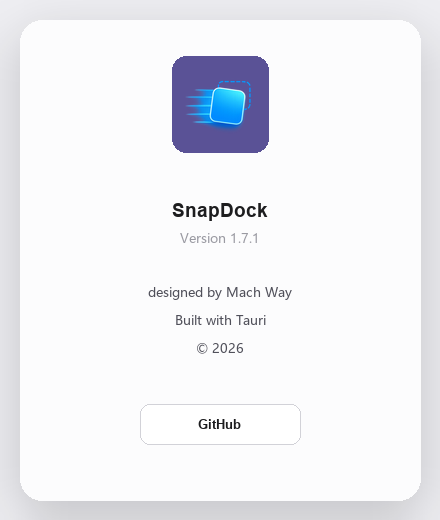

# SnapDock

> Fast Window Layout Manager for Windows

SnapDock is a lightweight Windows window layout manager that lets you instantly switch between multiple window arrangement presets via global hotkeys, and supports saving your frequently used spatial layouts.

---

## ✨ Key Features

- **Out of the box** —— Unzip and run, no installation, no runtime dependencies (only uses the system's built-in WebView2).
- **Lightweight background running** —— Closing the window does not exit the program; it automatically minimizes to the system tray and stays resident, with extremely low memory footprint and imperceptible residency.
- **Responsive hotkey switching** —— Global hotkeys respond instantly; window arrangement is completed in a flash without interrupting your current work.
- **Save frequently used spatial layouts** —— 4 slots for one-click save / restore of your workspace.
- **4 built-in layouts** —— Single window / Left-right split / Three windows / Four-grid, ready to use out of the box.
- **Bilingual (Chinese & English)** —— Simplified Chinese / English, switch instantly from the tray menu.
- **Launch at startup** —— Optionally writes `HKCU\...\Run\SnapDock`, no administrator privileges required.
- **Built with Tauri + Rust** —— Small footprint, great performance, without Electron's bloat.

---

## 🚀 Quick Start (Out of the Box)

1. Download the latest `SnapDock_v1.7.1_portable.zip` from the [Releases](../../releases) page.
2. Right-click and extract to any folder.
3. Double-click `SnapDock.exe`.

Done. No installation, no registry writes (except the optional startup entry), and no bundled runtimes. It only depends on WebView2, which is pre-installed on the vast majority of Windows 10/11 machines.

---

## 🔆 Background Running (Lightweight Residency)

SnapDock is designed as a **resident background** window tool:

- Click the window close button —— the program **does not exit**, but minimizes to the system tray.
- Right-click menu of the system tray icon:
  - **SnapDock** (title)
  - **Layout** ▸ Single window / Left-right split / Three windows / Four-grid (click to apply)
  - **Keyboard Shortcuts** —— Open the shortcut guide
  - **Language** ▸ Simplified Chinese / English
  - **Launch at Startup** —— Check to auto-launch on next login
  - **About**
  - **Exit**

> Staying resident in the tray means it is always on standby, ready to be summoned by hotkeys at any time, consuming almost no system resources.

---

## ⌨️ Shortcuts (Responsive)

Global hotkeys take effect instantly without needing to focus the SnapDock window:

| Shortcut | Function |
| --- | --- |
| `Ctrl` + `~` | Show / hide the SnapDock panel |
| `1` / `2` / `3` / `4` | Switch layout: Single window / Left-right split / Three windows / Four-grid |
| `Ctrl` + `Tab` | Rotate window order |
| `Ctrl` + `←` / `→` / `↑` / `↓` | Swap window position left / right / up / down |
| `Ctrl` + `Shift` + `1`–`4` | Save current workspace to the corresponding slot |
| `Ctrl` + `1`–`4` | Restore the workspace saved in the corresponding slot |
| `Esc` | Close panel / popup |

---

## 💾 Save Frequently Used Spatial Layouts

You can save the **positions and sizes of all current windows** as a layout, then restore it with one click:

1. Manually drag windows to your preferred positions (e.g., browser on the left, editor on the right, terminal at the bottom).
2. Press `Ctrl` + `Shift` + `1` to save as "Layout 1".
3. No matter how messy the windows get later, press `Ctrl` + `1` to **instantly restore** this arrangement.
4. There are 4 independent slots (`1`–`4`), each can save a different scenario: work, slacking off, presentation, reading…

---

## 📸 Screenshot Preview

| | |
| --- | --- |
|  |  |
|  |  |
|  |  |
|  |  |

---

## 🛠 Tech Stack

- **[Tauri 2](https://tauri.app/)** —— Application framework
- **Rust** —— Core engine and system interaction
- **Native WebView (HTML / CSS / JavaScript)** —— No frontend framework, pure native JS

---

## 🗺 Roadmap

See [ROADMAP.md](ROADMAP.md) for details, including multi-monitor support, customizable shortcuts, layout import/export, and more.

---

## 📄 License

SnapDock is released as open source under the [MIT License](LICENSE).
